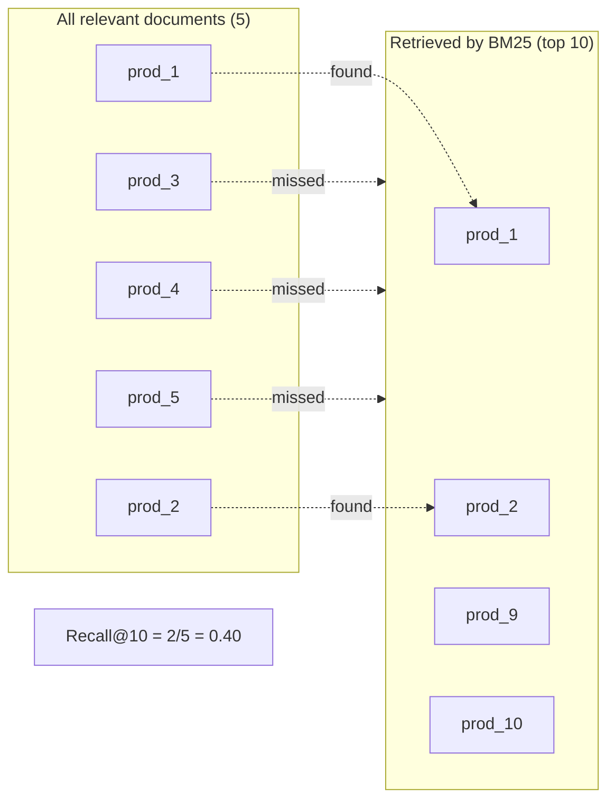

## Query Test Results

| Query | BM25 | Semantic | Hybrid |
|-------|------|----------|--------|
| running shoes | 0.600 | 0.900 | 0.800 |
| comfortable shoes for standing all day | 0.000 | 0.500 | 0.333 |
| outdoor camping gear | 0.429 | 0.429 | 0.429 |
| pet travel accessories | 0.400 | 1.000 | 0.800 |
| back pain relief | 0.200 | 0.200 | 0.200 |
| rainy day essentials | 0.000 | 0.000 | 0.000 |
| cooking for beginners | 0.000 | 0.250 | 0.250 |
| home workout | 0.000 | 0.400 | 0.200 |
| toddler birthday present | 0.250 | 0.250 | 0.250 |
| self care products | 0.000 | 0.000 | 0.000 |
| study desk setup | 0.500 | 1.000 | 0.750 |
| bluetooth speaker | 1.000 | 1.000 | 1.000 |
| protect phone screen | 0.000 | 0.000 | 0.000 |
| hiking shoes | 0.333 | 0.333 | 0.333 |
| gym equipment | 0.286 | 0.714 | 0.429 |
| skincare routine | 0.222 | 0.667 | 0.667 |
| work from home setup | 0.222 | 0.222 | 0.222 |
| gift for kids | 0.167 | 0.167 | 0.000 |
| men's casual outfit | 0.143 | 0.286 | 0.143 |
| baby shower gift | 0.500 | 0.167 | 0.333 |
| **AVERAGE** | **0.263** | **0.424** | **0.357** |

