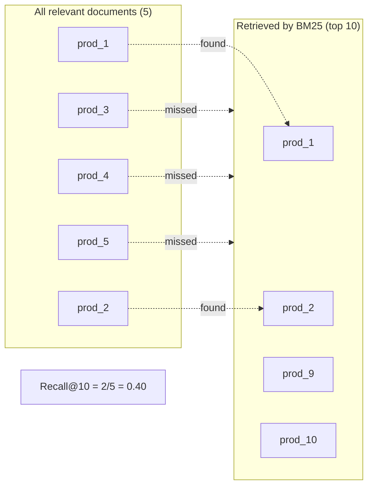

```mermaid
flowchart LR
    subgraph Universe["All relevant documents (5)"]
        A[prod_1]
        B[prod_2]
        C[prod_3]
        D[prod_4]
        E[prod_5]
    end

    subgraph Retrieved["Retrieved by BM25 (top 10)"]
        A2[prod_1 ]
        B2[prod_2 ]
        F[prod_9 ]
        G[prod_10 ]
    end

    A -.->|found| A2
    B -.->|found| B2
    C -.->|missed| Retrieved
    D -.->|missed| Retrieved
    E -.->|missed| Retrieved

    note["Recall@10 = 2/5 = 0.40"]
```